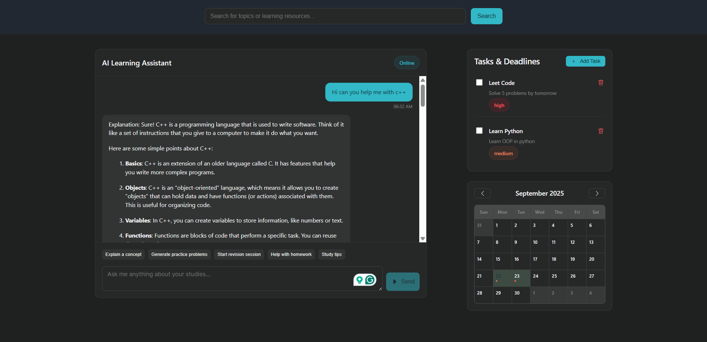
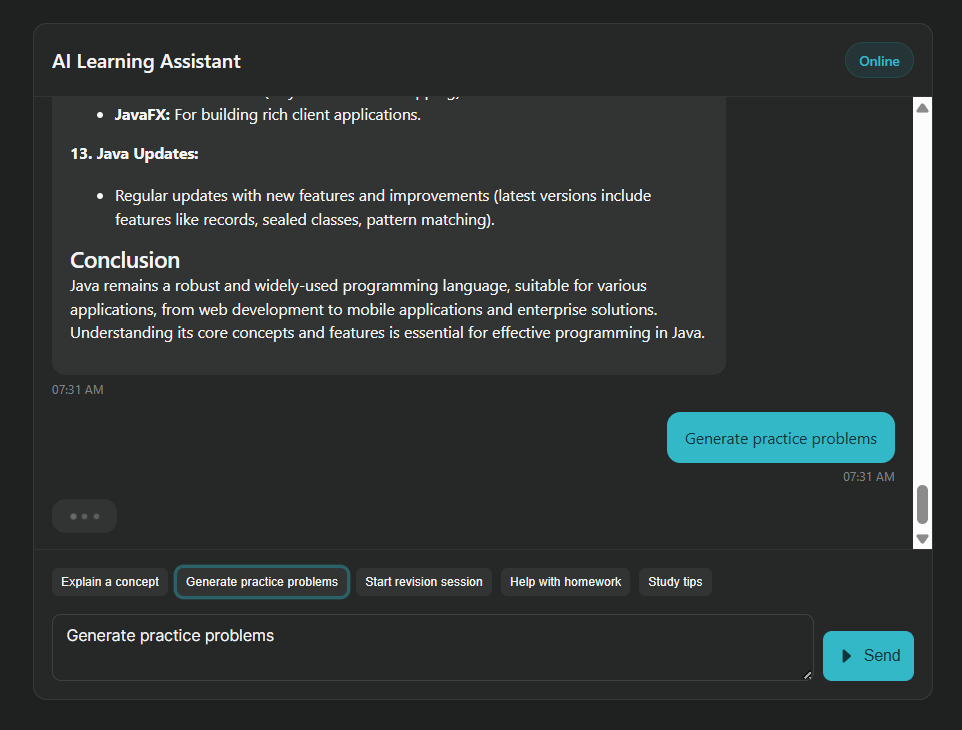
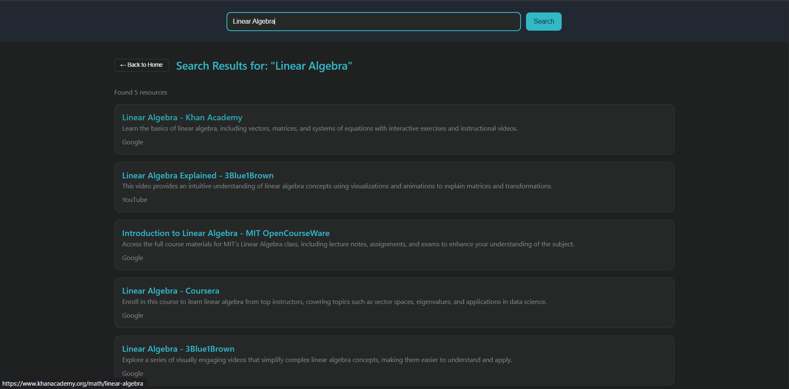
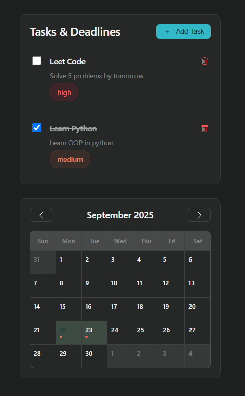

# Knowva

## Overview

The **Knowva** is a web-based application designed to provide a personalized, interactive, and efficient learning experience. This tool helps users progress through their learning journey with different levels of assistance, ranging from basic explanations to advanced integrations with productivity tools. 

The app adapts to the user’s learning needs by offering features such as practice problems, revision tools, resource integrations, and more. Whether you are a student, a self-learner, or a professional looking to enhance your skills, Knowva offers a tailored approach to learning.

## Live Demo

You can explore the live demo of the project by clicking the link below:

- [Visit Live Demo](https://tj2noyhdmenib-frontend--80.prod1b.defang.dev/)
The website is hosted using the **Defang** platform.

## Table of Contents

- [Features](#features)
  - [Level 1](#level-1)
  - [Level 2](#level-2)
  - [Level 3](#level-3)
- [Technologies](#technologies)
- [Installation](#installation)
- [Usage](#usage)
- [Contributing](#contributing)
- [License](#license)

## Features

### Level 1 - Core Learning Tools
- **Interactive Chat Interface**: A user-friendly platform designed to facilitate real-time engagement, allowing users to ask questions and receive tailored responses.
- **Clear Explanations**: Offering succinct, easily understandable explanations on a broad range of topics to ensure users can grasp essential concepts with clarity.
- **Practice Exercises**: Providing a series of practice problems to assess comprehension and reinforce learning through hands-on application.
- **Revision Assistance**: Tools and resources to support the revision of previously covered material, ensuring knowledge retention and mastery.

  

### Level 2 - Resource Integration
- **External Learning Integrations**: Seamless access to a curated selection of online resources, including websites, articles, and videos, to enhance the learning experience.

  

### Level 3 - Advanced Learning Features
- **Progress Tracker & Calendar**: Monitor progress with personalized reminders for upcoming tasks, exams, and milestones, ensuring timely preparation and organization.
- **Comprehensive Learning Assistant**: An all-encompassing, AI-powered assistant that offers tailored recommendations, adaptive learning paths, and ongoing motivational support to guide users toward their goals.

  

## Technologies

- **Frontend**: React.js
- **Backend**: Express.js
- **Deployment**: Defang

## Installation

### Prerequisites

1. **Node.js**: Ensure that you have Node.js installed on your local machine.
2. **API Keys**: Obtain necessary API keys.

### Steps to Run Locally

